# Consolidated Construction Marketplace Database Schema

This document provides a consolidated view of the database schema across all phases of the Construction Marketplace platform.

---

## Phase 1: Materials Liquidity Engine (Core Marketplace & Payments)

### Payment Model
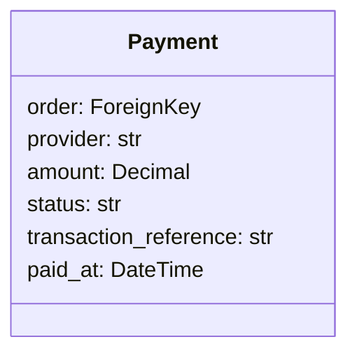

### Dispute Model
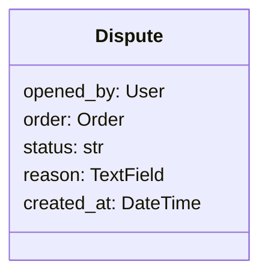

### Vendor Performance & Trust Signals (Part of Vendor Profile)
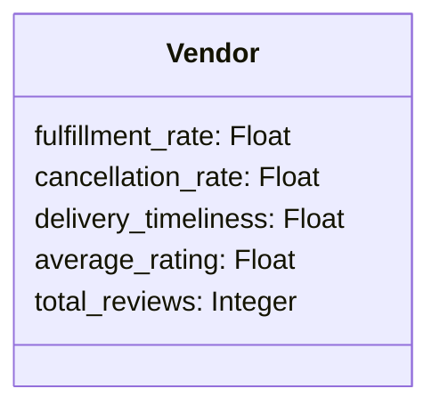

---

## Phase 2: Contractor + Contracts Execution Layer

### Contractor Profile (`contractors_contractor`)
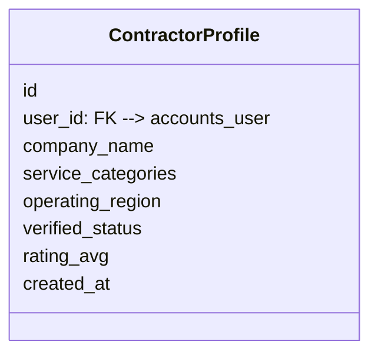

### Contractor Certifications (`contractors_certification`)
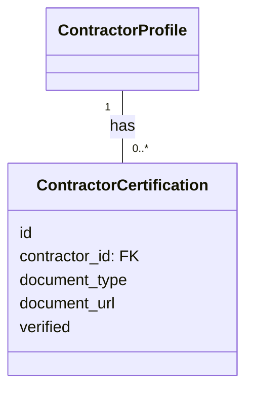

### Contract (`contracts_contract`)
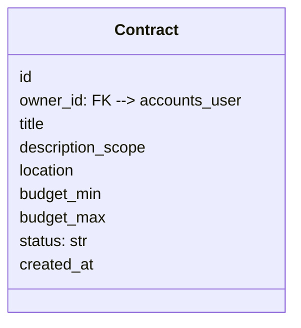

### Bid (`contracts_bid`)
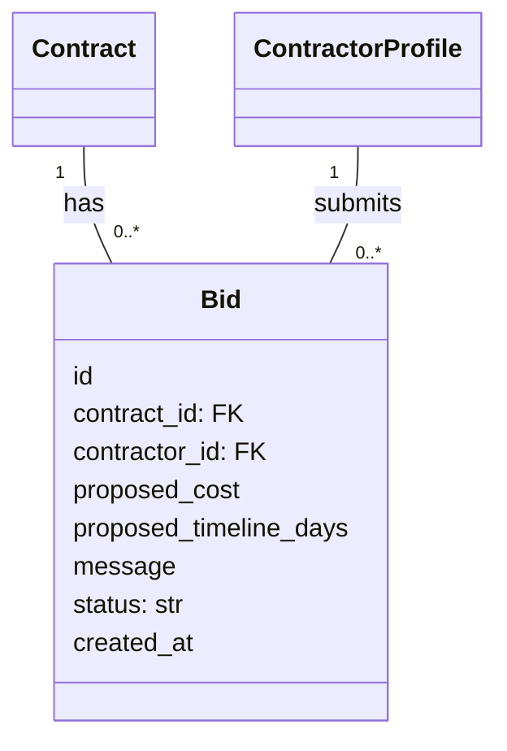

### Milestone (`contracts_milestone`)
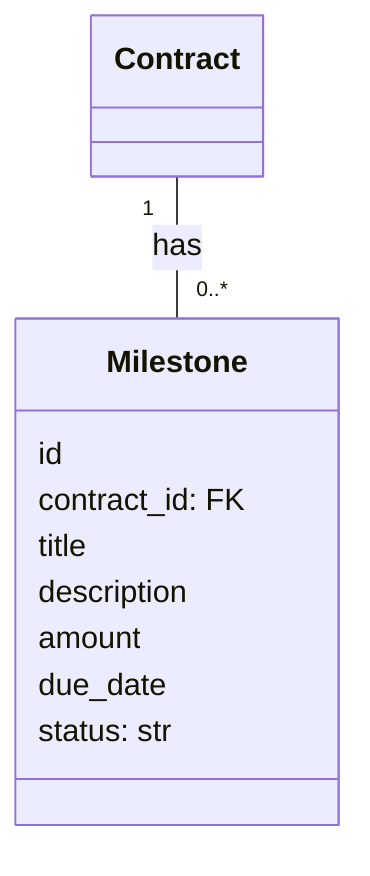

### Milestone Payment (`payments_milestone_payment`)
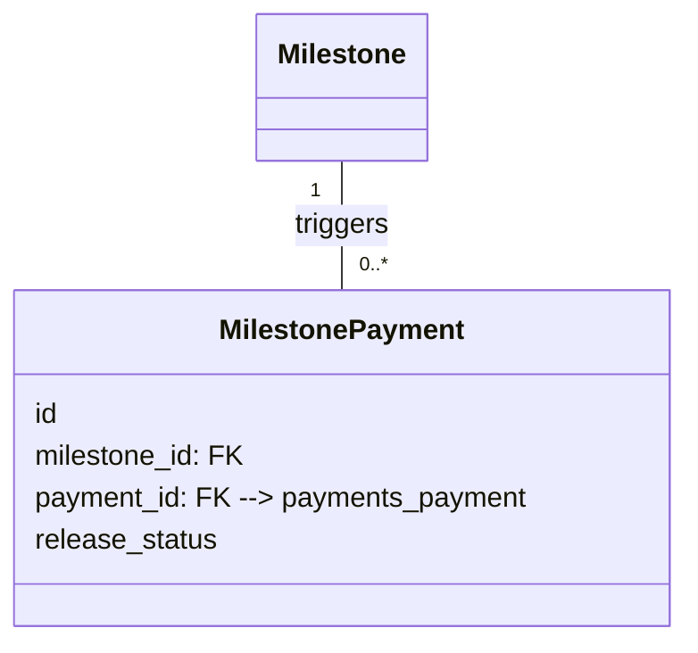

### Contractor Review (`reviews_contractor_rating`)
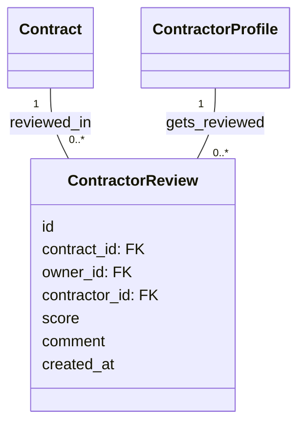

---

## Phase 3: Escrow + Embedded Finance Layer

### Escrow Account (`escrow_account`)
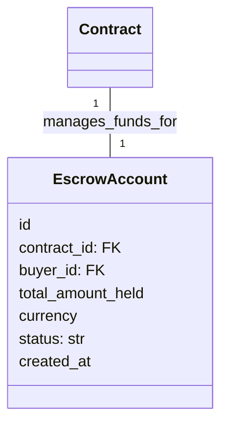

### Escrow Transaction (`escrow_transaction`)
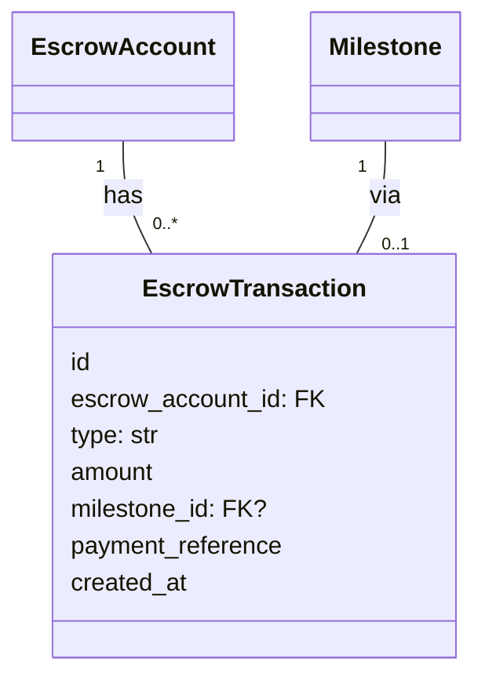

### Escrow Release (`escrow_release`)
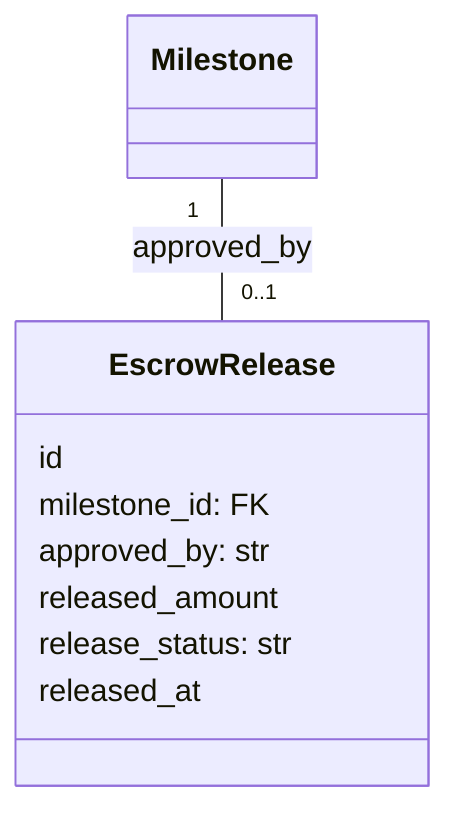

### Escrow Dispute Hold (`escrow_hold`)
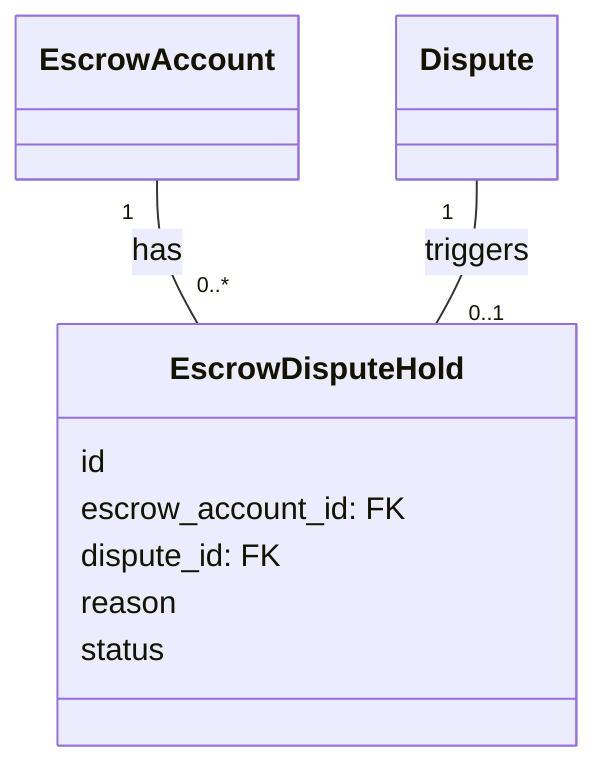

---

## Phase 4: Projects + Property + Capital Pipeline

### Project (`projects_project`)
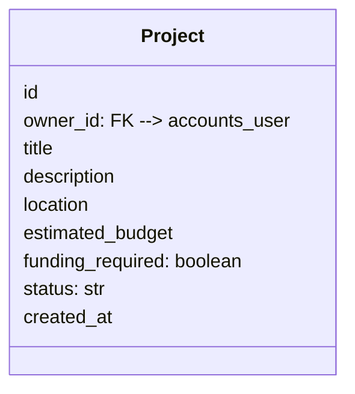

### Project Requirement (`projects_requirement`)
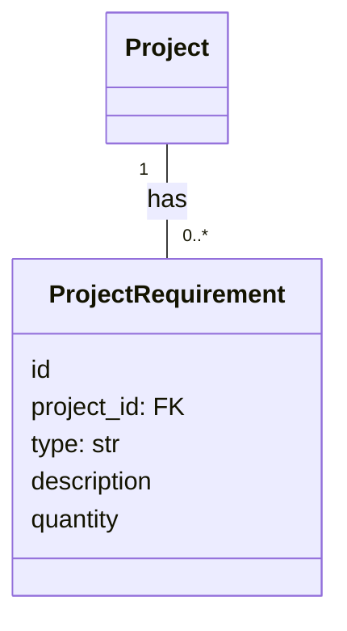

### Investment Commitment (`projects_investment_commitment`)
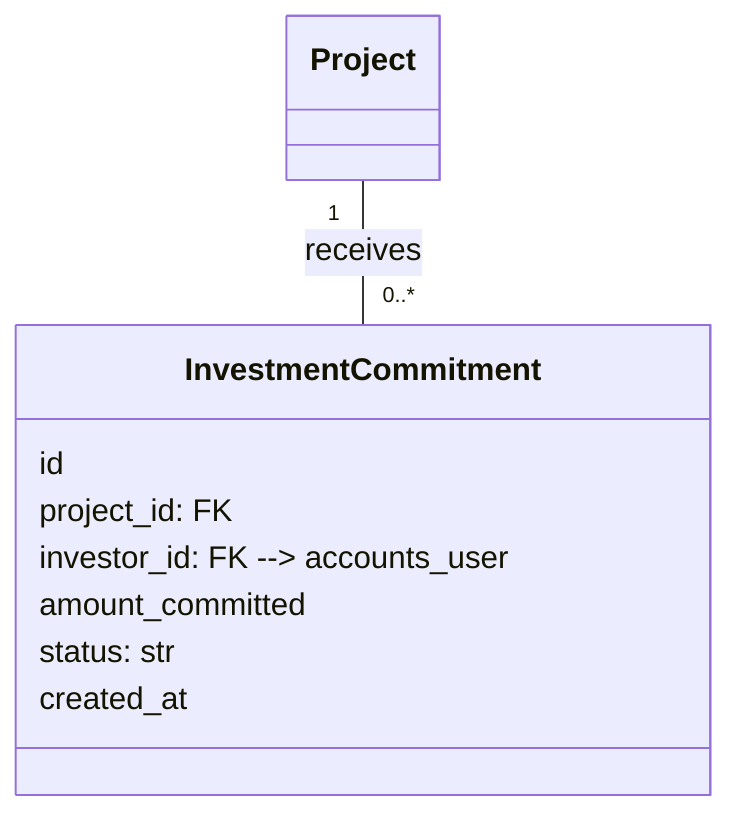

### Project Contract Link (`projects_project_contract`)
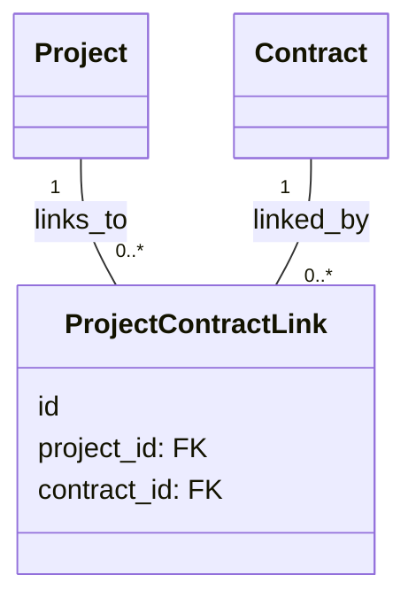

### Project Update (`projects_update`)
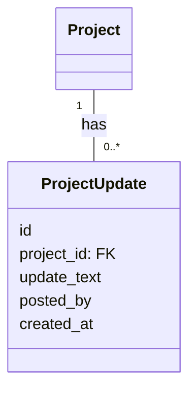

### Property Listing (`property_listing`)
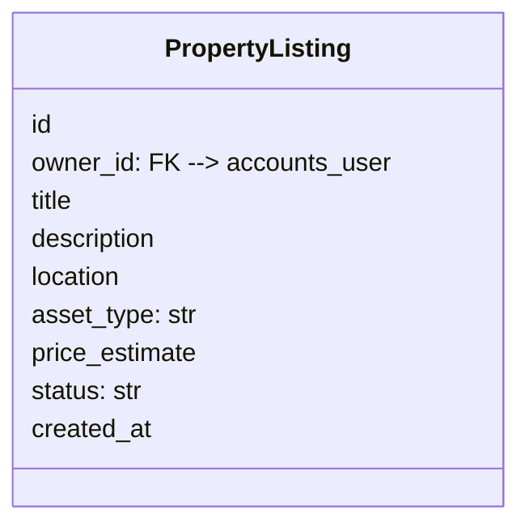

### Development Metadata (`property_development`)
```mermaid
classDiagram
    class DevelopmentMetadata {
        id
        property_id: FK
        zoning_info
        build_ready: boolean
        utilities_available
    }
    PropertyListing "1" -- "0..1" DevelopmentMetadata : has
```

### Property Project Link (`property_project_link`)
```mermaid
classDiagram
    class PropertyProjectLink {
        id
        property_id: FK
        project_id: FK
    }
    PropertyListing "1" -- "0..*" PropertyProjectLink : associated_with
    Project "1" -- "0..*" PropertyProjectLink : associated_with
```

---

## Phase 5: Regulated Investment + Enterprise + Government Layer

### Investor (`investor_profile`)
```mermaid
classDiagram
    class InvestorProfile {
        id
        user_id: FK --> accounts_user
        kyc_status: str
        accreditation_status
        jurisdiction
        created_at
    }
```

### Investment Agreement (`investment_agreement`)
```mermaid
classDiagram
    class InvestmentAgreement {
        id
        project_id: FK
        investor_id: FK
        amount
        agreement_terms_url
        status: str
        signed_at
    }
    InvestorProfile "1" -- "0..*" InvestmentAgreement : enters
    Project "1" -- "0..*" InvestmentAgreement : for
```

### Investment Transaction (`investment_transaction`)
```mermaid
classDiagram
    class InvestmentTransaction {
        id
        agreement_id: FK
        escrow_account_id: FK
        type: str
        amount
        created_at
    }
    InvestmentAgreement "1" -- "0..*" InvestmentTransaction : results_in
    EscrowAccount "1" -- "0..*" InvestmentTransaction : involves
```

### Investor Report (`investor_report`)
```mermaid
classDiagram
    class InvestorReport {
        id
        project_id: FK
        investor_id: FK
        report_period
        performance_summary
        created_at
    }
    InvestorProfile "1" -- "0..*" InvestorReport : receives
    Project "1" -- "0..*" InvestorReport : reports_on
```
