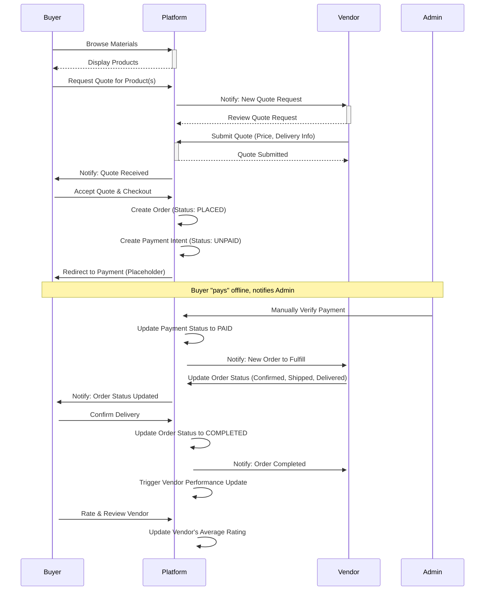
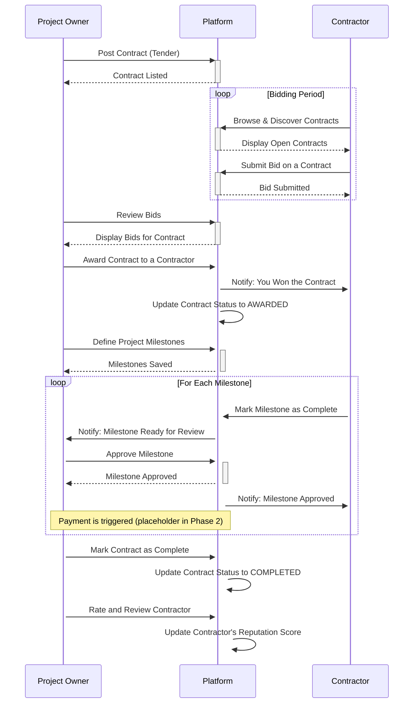
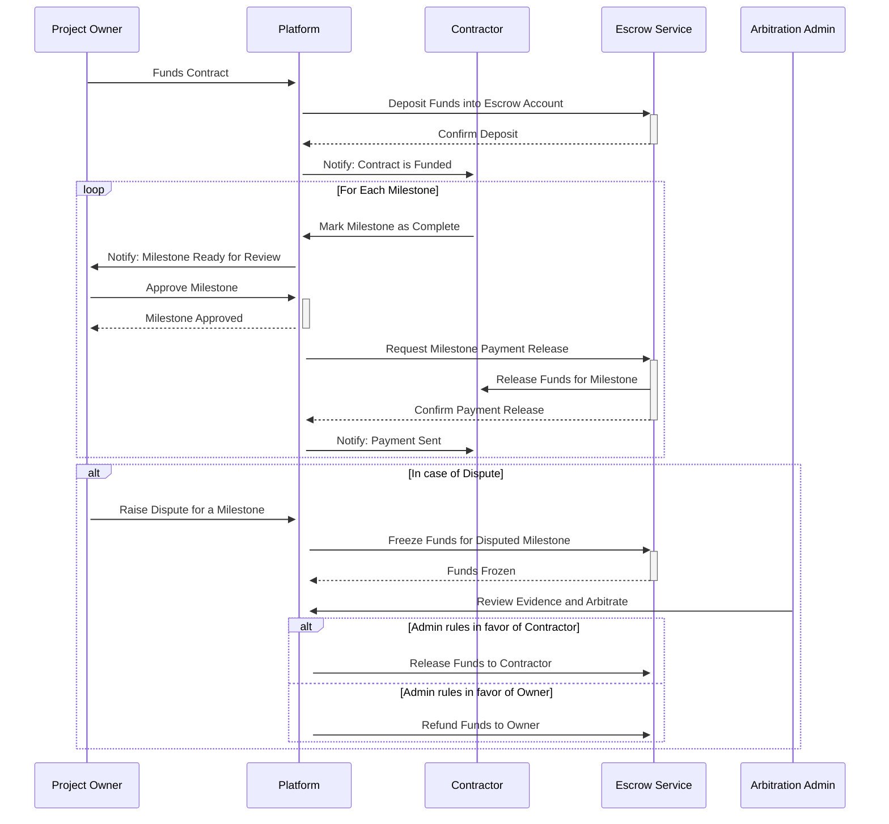
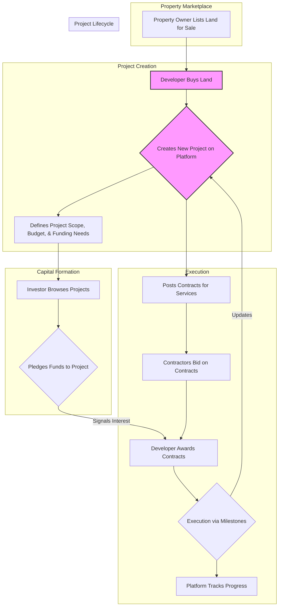
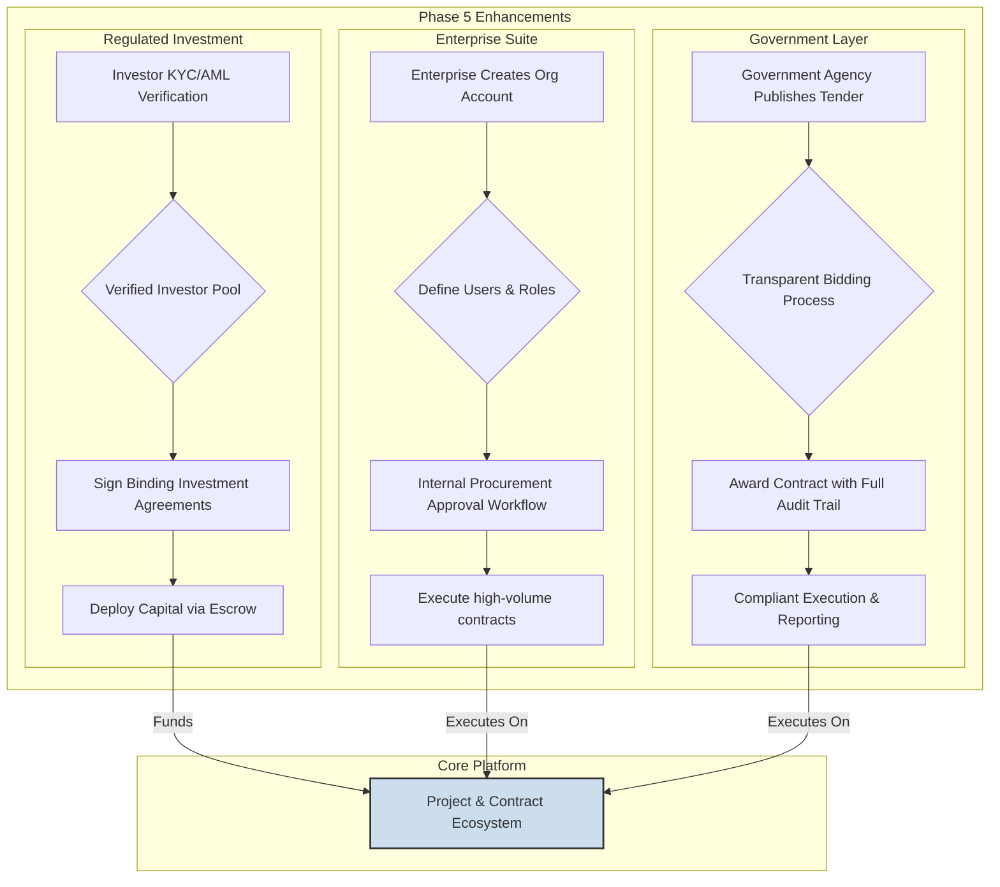
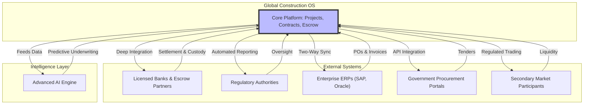

# Global Construction Marketplace OS — Investor Narrative

## 1. The Problem (Expanded)
Construction is one of the world’s largest industries — representing trillions of dollars in annual spend — yet it remains among the least digitized and most operationally fragmented sectors.
Unlike retail, logistics, or fintech, construction commerce still operates through:
Informal supplier networks
Manual procurement and quoting
Limited transparency on contractor performance
High dispute rates and payment uncertainty
This creates systemic inefficiencies across every construction market globally.

### Core Structural Failures
- **Fragmented Supply Markets:** Materials sourcing is inconsistent and localized. Vendors operate in silos, and buyers struggle to compare pricing, quality, and availability. Procurement is slow and relationship-driven.
- **Low Trust Contractor Ecosystems:** Contractors are difficult to evaluate due to limited verification and no unified reputation history, leading to high execution risk for owners.
- **Payment and Delivery Risk:** High-value construction transactions mean buyers fear non-delivery, while vendors fear non-payment. Contractors face delayed milestone payments.
- **Lack of Financing Access:** Most actors are under-capitalized. Contractors lack working capital, suppliers cannot extend credit safely, and buyers struggle with staged funding.
- **Poor Execution Transparency:** Projects often fail due to a lack of structured milestone accountability. Delays are difficult to detect early, disputes escalate without evidence frameworks, and capital is deployed inefficiently.

### The Result
The construction industry experiences:
- Chronic cost overruns
- Delayed delivery timelines
- Limited access to financing
- High fraud and dispute exposure
- Massive inefficiency across global supply chains

Construction projects are delayed, over budget, under-financed, and operationally opaque.

## 2. The Opportunity (Expanded)
Construction is one of the largest economic engines on earth — yet it remains structurally underserved by modern platforms. This is not a niche vertical. Construction is the foundational layer of housing, infrastructure, commercial real estate, and industrial buildouts. Globally, trillions of dollars flow through construction every year — but the market is still operated through disconnected intermediaries.

### Construction is a Full Economic Stack
Unlike traditional marketplaces, construction commerce spans multiple intertwined layers:
- Materials supply chains
- Contractor execution markets
- Project financing and capital deployment
- Procurement governance
- Regulatory compliance
- Long-duration milestone delivery

This means the opportunity is not just e-commerce. It is an operating system opportunity.

### Market Gap
There is currently no unified platform that connects:
- Supply (vendors)
- Execution (contractors)
- Capital (financing + investors)
- Governance (escrow + disputes)
- Institutions (enterprise + government)

The first platform to unify these layers becomes the default infrastructure for global construction.

## 3. Our Solution (Expanded)
We are building the world’s first:
**Global Construction Marketplace + Finance + Procurement Infrastructure OS**
A single platform where every participant in construction can transact with trust:
- **Vendors:** Upload materials inventory, reach global buyers, and build verified performance history.
- **Buyers and Developers:** Source materials competitively, hire contractors transparently, and execute projects with milestone accountability.
- **Contractors:** Access contract opportunities, receive escrow-backed payments, and build reputational capital.
- **Investors and Financiers:** Fund construction pipelines safely, deploy capital tied to verified execution.
- **Enterprises and Governments:** Procure at scale with audit-ready governance.

## 4. Why Now (Expanded)
Construction is at an inflection point driven by three irreversible shifts:
1.  **Supply Chains Are Digitizing:** Materials procurement is moving online due to rising logistics complexity, price volatility, and demand for supplier transparency.
2.  **Embedded Finance is Reshaping Commerce:** The most valuable marketplaces now integrate payments, escrow, credit, and risk underwriting. Construction is the largest vertical where this is still missing.
3.  **Institutions Demand Accountability:** Governments and enterprises increasingly require transparent tendering, audit trails, anti-corruption enforcement, and ESG-aligned procurement.

Construction is the next major platform shift after retail and logistics.

## 5. Platform Strategy (Expanded Phased Moat)
We execute through compounding layers that progressively deepen defensibility.

### Phase 1 — Materials Liquidity Engine

This phase focuses on creating a liquid and trustworthy materials procurement marketplace. It's the foundational layer of the platform, designed to attract and retain both buyers and vendors through a seamless and secure transaction process.

*   **Vendor Onboarding and Verification:** A crucial step to build trust. Vendors undergo a verification process by platform administrators before they can list products. This ensures that only legitimate and reliable suppliers are part of the marketplace.
*   **Structured Product Catalog:** The platform implements a hierarchical taxonomy for materials, allowing for easy navigation and search. Vendors can manage their inventory, including pricing, stock levels, and product descriptions.
*   **Flexible Procurement:** The primary workflow is a "quote-to-order" system. Buyers can request quotes for specific materials, and vendors respond with competitive pricing. This is ideal for the construction industry where pricing can be volatile and dependent on quantity.
*   **Transparent Order Management:** A robust order management system tracks the entire lifecycle of a transaction, from order placement to final delivery. Both buyers and vendors have a clear view of the order status at every stage.
*   **Reputation System:** The platform introduces a basic reputation system. Vendor performance is monitored based on metrics like fulfillment rate and delivery timeliness. Buyers can rate and review vendors upon order completion, building a meritocratic ecosystem.
*   **Foundation for Future Growth:** While Phase 1 has some manual processes (like payment verification and dispute resolution), it lays the essential groundwork for future automation and the introduction of more advanced financial products in later phases.

**Mermaid Diagram: Quote-to-Order Workflow**

### Phase 2 — Contractor + Contracts Execution Layer

This phase evolves the platform from a simple materials marketplace into a dynamic contract execution ecosystem. By introducing a new "contractor" user role and a comprehensive bidding system, the platform starts to manage the entire project lifecycle, not just procurement.

*   **Contractor Marketplace:** A new marketplace is introduced where contractors can create detailed profiles, showcasing their skills, certifications, and past work. A verification process ensures that only qualified and trustworthy contractors can participate.
*   **Competitive Bidding:** Project owners can post detailed tenders for their construction projects. Verified contractors can then submit competitive bids, fostering a transparent and efficient pricing environment.
*   **Structured Project Execution:** Awarded contracts are broken down into clear, manageable milestones. This provides a structured framework for project execution, ensuring that both the project owner and the contractor have a shared understanding of the deliverables and timelines.
*   **Milestone-Based Payments:** Payments are tied to the successful completion of milestones. When a contractor completes a milestone, the project owner approves it, which then triggers the payment. This reduces payment disputes and improves cash flow for contractors.
*   **Enhanced Reputation and Trust:** The reputation system is expanded to include contractors. Project owners can rate contractors based on their performance, and this data is used to create a trust score for each contractor, helping project owners make informed decisions.

**Mermaid Diagram: Contract Lifecycle**

### Phase 3 — Escrow + Embedded Finance Layer

This phase transforms the platform into a true fintech-enabled marketplace by building a robust financial infrastructure. It introduces a layer of trust and security that is essential for high-value construction transactions.

*   **Escrow-Backed Payments:** The platform integrates a secure escrow system, where project funds are held by a neutral third party until milestones are met. This eliminates payment risk for both buyers and contractors, which is one of the biggest problems in the construction industry.
*   **Automated Milestone Releases:** Payments are no longer manual. The escrow system is connected to the milestone tracker, and funds are automatically released to the contractor as soon as the project owner approves a completed milestone. This ensures that contractors are paid on time, every time.
*   **Formalized Dispute Resolution:** A structured dispute resolution process is implemented. In the event of a disagreement, a neutral administrator can step in to mediate, review evidence, and make a binding decision on the release of escrowed funds. This provides a fair and efficient way to resolve conflicts.
*   **Embedded Financing and Credit:** The platform begins to offer financial products tailored to the needs of the construction industry. This includes credit lines for purchasing materials and working capital loans for contractors, helping to solve the liquidity challenges that are so common in the sector.
*   **Data-Driven Underwriting:** A proprietary credit scoring model is developed, using the platform's rich transactional data to assess risk and determine creditworthiness. This allows for faster and more accurate lending decisions than traditional financial institutions.

**Mermaid Diagram: Escrow-Backed Milestone Workflow**

### Phase 4 — Projects + Property + Capital Pipeline

In this phase, the platform evolves from a transactional marketplace into a strategic project pipeline and capital formation engine. It moves beyond individual contracts to manage the entire lifecycle of a construction project, from land acquisition to final delivery.

*   **End-to-End Project Marketplace:** The platform introduces a new "Projects" layer. Developers and project sponsors can list entire construction projects, defining their scope, budget, and required resources. This provides a holistic view of a project, aggregating all the necessary contracts for materials and services.
*   **Upstream Demand from Property Listings:** A "Property" marketplace is created where landowners and real estate developers can list assets for sale or development. This serves as a powerful upstream engine, allowing new construction projects to be initiated directly from listed properties.
*   **Investor Participation and Capital Formation:** A foundational investment layer allows "Investor Guests" to browse projects and pledge non-binding financial commitments. This serves as a crucial signal of investor demand and helps project sponsors gauge funding interest before moving to a formal capital raise.
*   **Integrated Project Lifecycle Reporting:** The platform now provides a single source of truth for the entire construction lifecycle. It connects the property, the project, the contractors, and the financing into one integrated view. Stakeholders can track progress from the initial land purchase, through every construction milestone, to the final completed asset.
*   **Foundation for Global Scale:** The architecture is enhanced to support global operations, with features for multi-currency transactions, regional tax compliance, and cross-border logistics, preparing the platform for international expansion.

**Mermaid Diagram: Project Lifecycle**

### Phase 5 — Regulated Investment + Enterprise + Government Layer

This phase marks the platform's evolution into a fully regulated, institutional-grade infrastructure for construction commerce. It expands into the enterprise and government sectors, building a deep, defensible moat through compliance and advanced features.

*   **Regulated Investment and Capital Markets:** The investment layer matures into a compliant marketplace. All investors undergo rigorous KYC/AML verification, enabling binding, regulated capital deployment. This unlocks access to institutional-grade investment from family offices, funds, and large-scale capital allocators.
*   **Enterprise Procurement Suite:** The platform introduces a powerful suite of tools for large-scale enterprises. This includes multi-user organizational accounts, hierarchical approval workflows, and budget controls. Enterprises can now manage their entire construction procurement process with enhanced governance and efficiency.
*   **Government Tendering and Public Works:** A dedicated, compliance-focused module is launched for government and public sector procurement. It ensures transparency in public tenders, provides immutable audit trails to prevent corruption, and meets the stringent requirements of public infrastructure projects.
*   **Advanced Compliance and Risk Engine:** An AI-powered engine is deployed to automate risk management. It performs real-time fraud detection, assesses the risk profiles of all participants, and ensures adherence to global and local regulatory requirements, making the platform one of the safest and most compliant in the industry.
*   **Global-Ready Infrastructure:** The platform's core infrastructure is upgraded to handle the complexities of international finance, including multi-currency settlements, jurisdictional tax handling, and data residency, paving the way for true global scale.

**Mermaid Diagram: Institutional & Government Integration**

### Phase 6 — Institutional Construction Infrastructure OS

This is the final, mature state of the platform, where it transcends being a marketplace to become the critical operating system for the global construction economy. It operates as a fully regulated, intelligent, and deeply integrated piece of financial and commercial infrastructure.

*   **Licensed Banking and Escrow Rails:** The platform integrates directly with licensed, regulated banking and escrow institutions. This ensures the highest level of security and compliance for all financial transactions, utilizing segregated client accounts and global settlement rails for seamless, multi-currency fund transfers.
*   **Automated Regulatory Compliance:** Reporting to tax authorities and financial regulators is fully automated. The system can generate and file all required compliance documentation, including tax forms and anti-money laundering reports, on behalf of its users, dramatically reducing administrative overhead.
*   **Predictive AI for Risk and Underwriting:** The platform's AI engine evolves to provide predictive risk analysis. It uses deep data analysis to forecast project default risk, detect sophisticated fraud patterns, and dynamically adjust credit limits, making it the most advanced underwriting engine in the construction industry.
*   **Deep Integration with Enterprise and Government Systems:** The platform achieves seamless, two-way integration with major ERP systems (like SAP and Oracle) and government procurement portals. This allows for automated data exchange, from syncing purchase orders to publishing public tenders, making the platform an indispensable part of its users' existing workflows.
*   **Pioneering Secondary Markets:** In jurisdictions where regulations permit, the platform will pilot a secondary market for construction finance. This will allow for the trading of investment stakes in projects, providing unprecedented liquidity to a traditionally illiquid asset class and unlocking a vast new pool of capital.

**Mermaid Diagram: Global Infrastructure Integration**

## 6. Business Model (Expanded)
Monetization scales with platform depth:
- **Phase 1:** Materials transaction commissions
- **Phase 2:** Contractor bidding + service marketplace fees
- **Phase 3:** Escrow fees + financing spreads
- **Phase 4:** Project listing fees + premium visibility
- **Phase 5:** Enterprise SaaS subscriptions + government procurement contracts
- **Phase 6:** Institutional settlement + compliance infrastructure fees
The platform compounds revenue as it moves deeper into execution and finance.

## 7. Defensibility (Expanded)
The moat strengthens structurally over time through:
- Marketplace liquidity and network effects
- Escrow trust infrastructure
- Proprietary underwriting data
- Contractor and supplier performance histories
- Regulatory compliance complexity
- Deep institutional integrations
Replication becomes extremely difficult beyond Phase 3.

## 8. End State Vision (Expanded)
By Phase 6, the platform operates as:
The global construction economy’s operating system — where materials, labor, capital, and procurement converge into trusted infrastructure.
This becomes the default marketplace where the world builds.

## 9. Investor Ask (Expanded)
We are raising to execute the initial liquidity and execution layers:
- Launch Phase 1 materials marketplace
- Onboard vendors and buyers
- Achieve repeat procurement volume
- Deploy Phase 2 contractor and contract execution layer
- Establish milestone accountability
Escrow and finance become the expansion moat.

**Investor Pitch Narrative Complete.**
