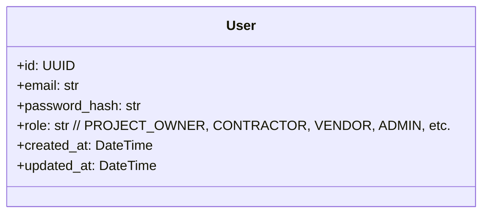
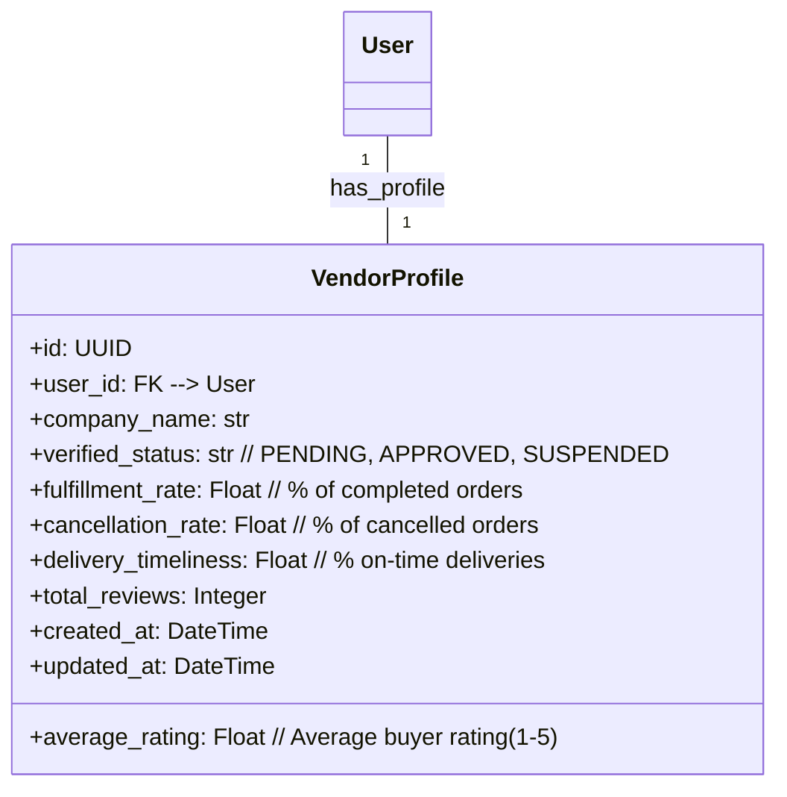
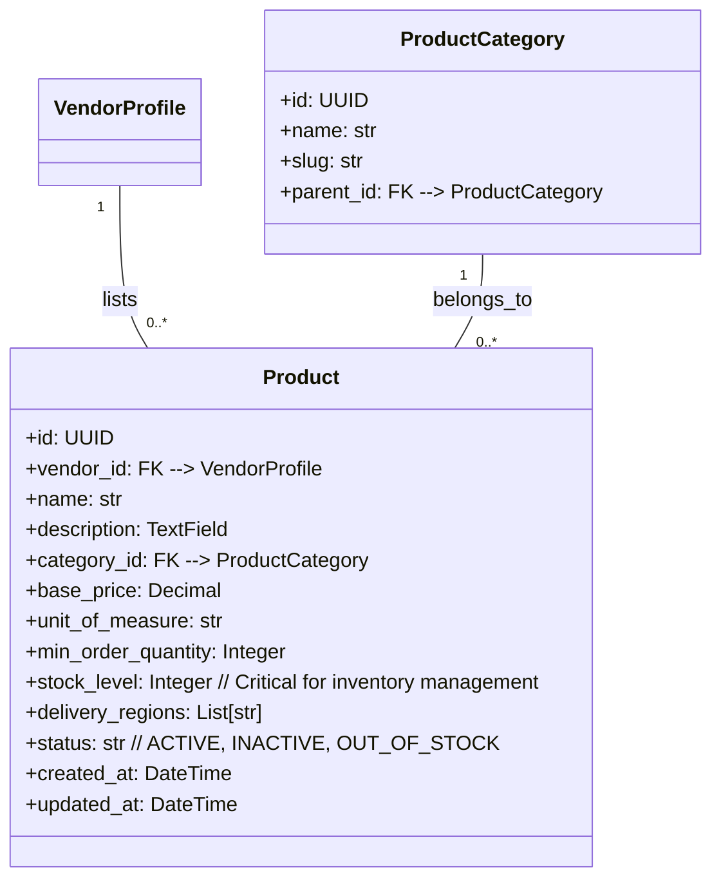
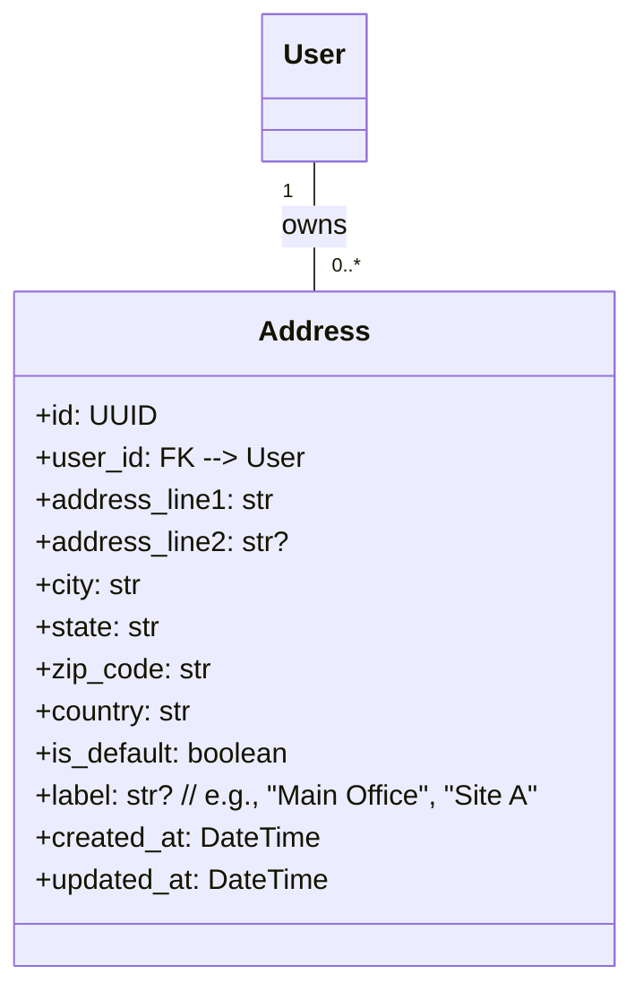
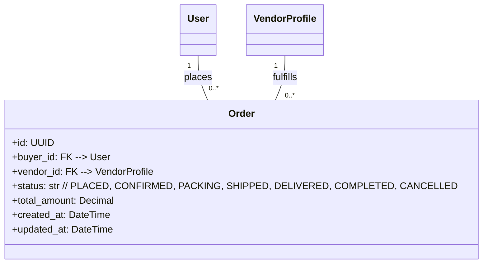
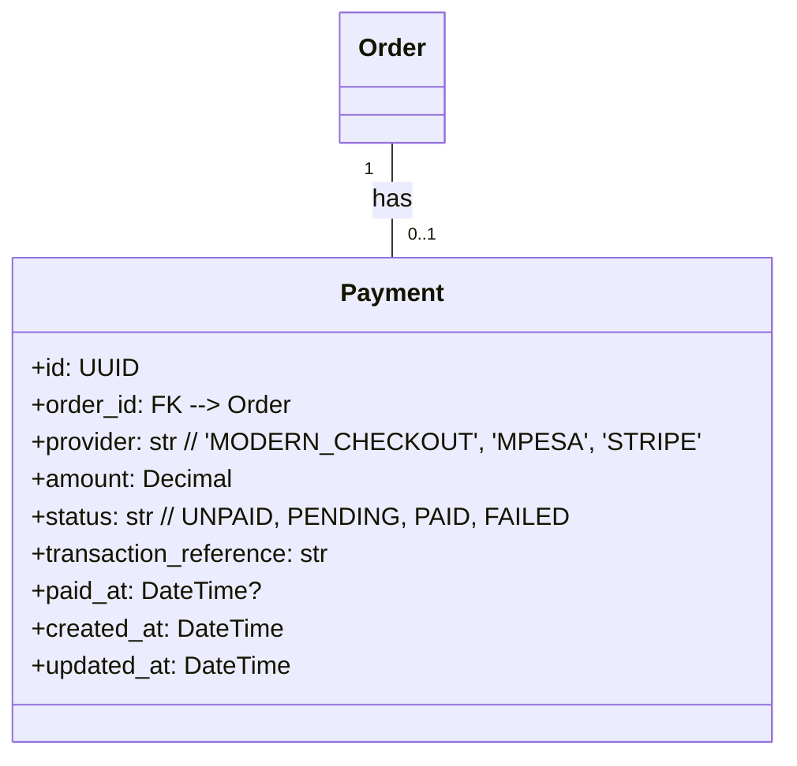
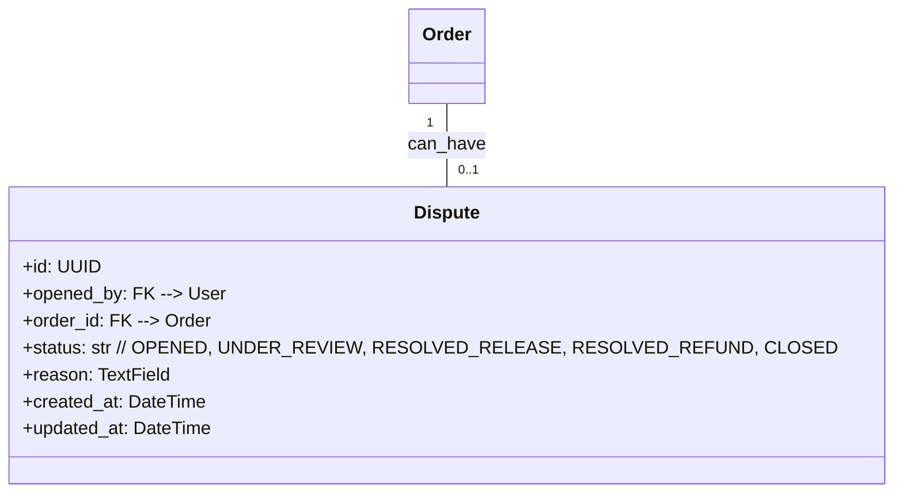

# Phase 1: Materials Liquidity Engine Schema

## Introduction

The Ujenzi Construction Marketplace is envisioned as the "Global Construction Marketplace + Finance + Procurement Infrastructure OS." Its architecture is designed to evolve through six distinct phases, each building upon the previous one, deepening its functionality and defensibility. This document consolidates the key database schemas that underpin this evolution, detailing the core entities, their attributes, and their relationships within each phase.

---

## Phase 1: Materials Liquidity Engine

**Overview:** This foundational phase establishes the core marketplace for construction materials. It focuses on connecting verified vendors with buyers, enabling product discovery, quote-to-order workflows, basic payment processing, and initial vendor performance tracking. The schemas in this phase lay the groundwork for user identities, product catalog, inventory, order management, and dispute resolution.

### Core Entities:

#### 1.1. User (`accounts_user`)
Represents any individual or entity interacting with the platform. This is the fundamental identity model from which all other roles (Buyer, Vendor, Admin, etc.) are derived. It forms the basis for authentication, permissions, and associating actions across the platform.

#### 1.2. Vendor Profile (`accounts_vendorprofile`)
Extends the base `User` model to capture specific information and performance metrics for vendors. It includes details essential for vendor verification and their reputation on the marketplace.

#### 1.3. Product (`catalog_product`)
Defines the structure for construction materials listed on the marketplace. It includes all necessary attributes for product identification, categorization, pricing, and crucial inventory management.

**Inventory Management Insight:** The `stock_level` field in the `Product` schema is central to inventory management. It enables real-time tracking of available materials, preventing overselling and allowing vendors to manage their stock levels efficiently. Integrations in later phases can build upon this to automate reordering or provide predictive stock analytics.

#### 1.4. Address (`accounts_address`)
Stores multiple addresses for users, essential for specifying delivery locations for orders and managing various site-specific addresses.

#### 1.5. Order (`orders_order`)
Manages the entire lifecycle of a material procurement request, from an initial quote request to final completion. It captures transactional details and the current fulfillment status.

#### 1.6. Payment (`payments_payment`)
Records all payment transactions related to orders. In Phase 1, this is a placeholder for manual tracking, setting up the structure for future integration with payment gateways.

#### 1.7. Dispute (`disputes_dispute`)
Provides a mechanism to track and manage conflicts or issues arising from orders.

---