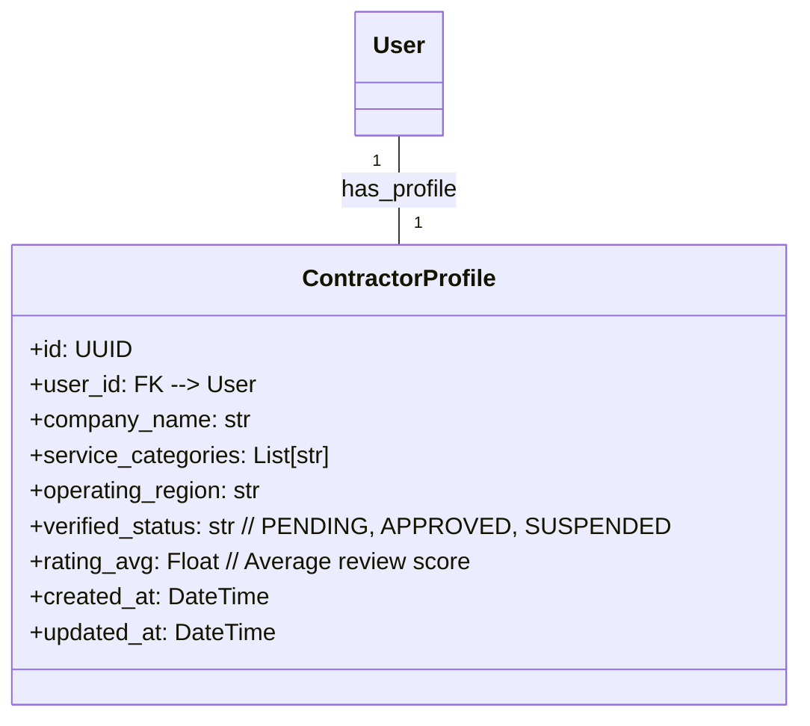
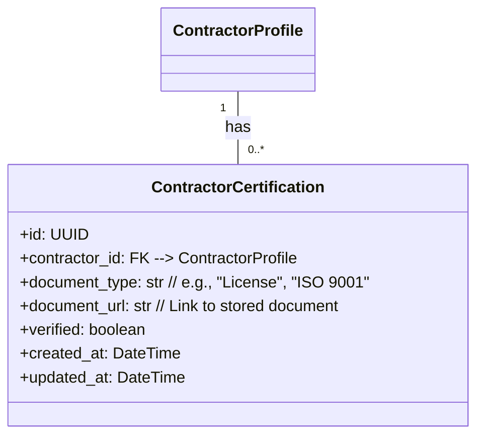
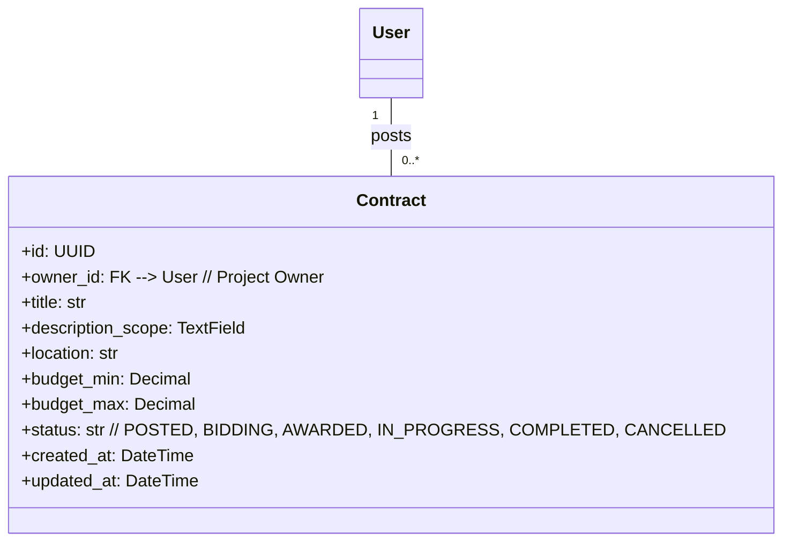
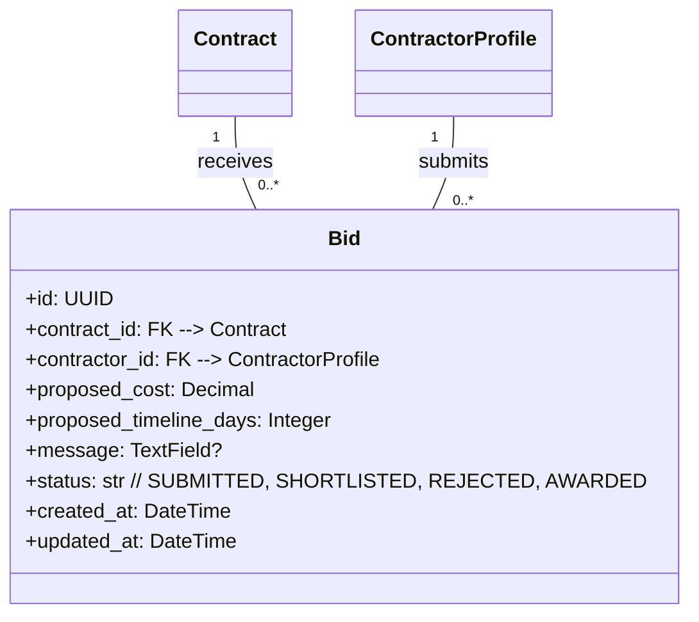
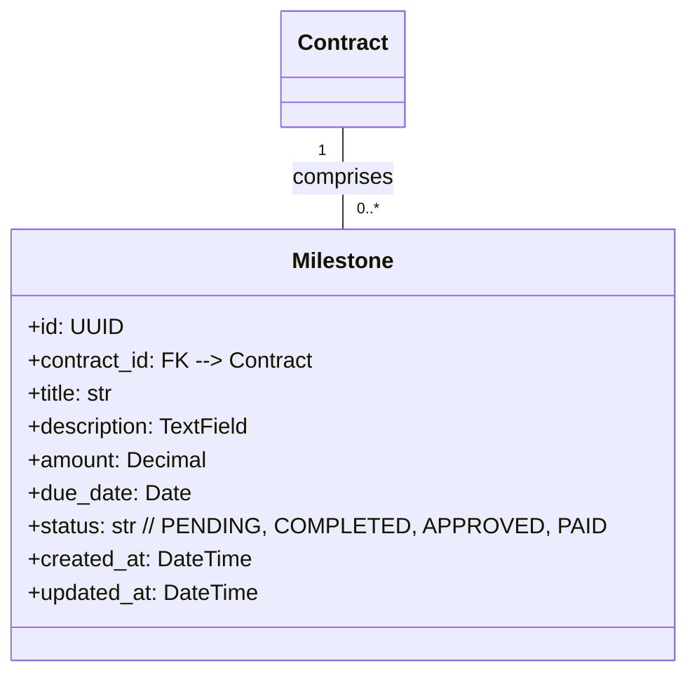
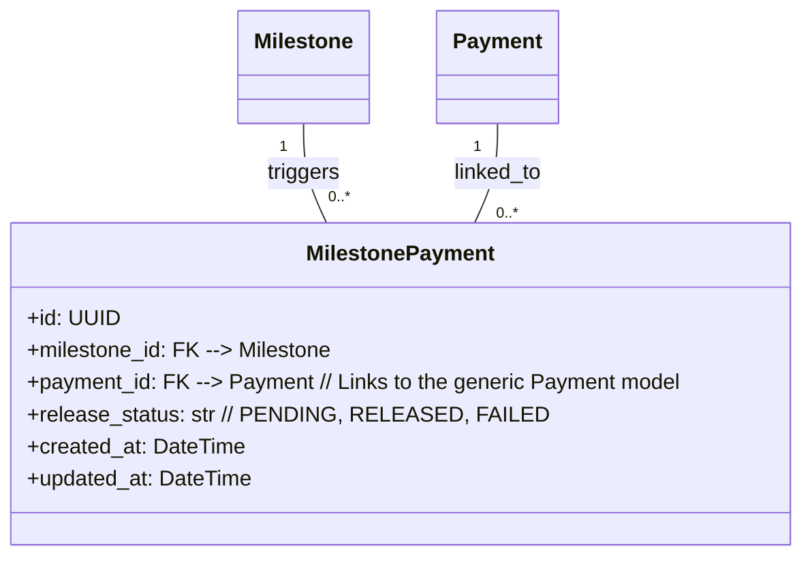
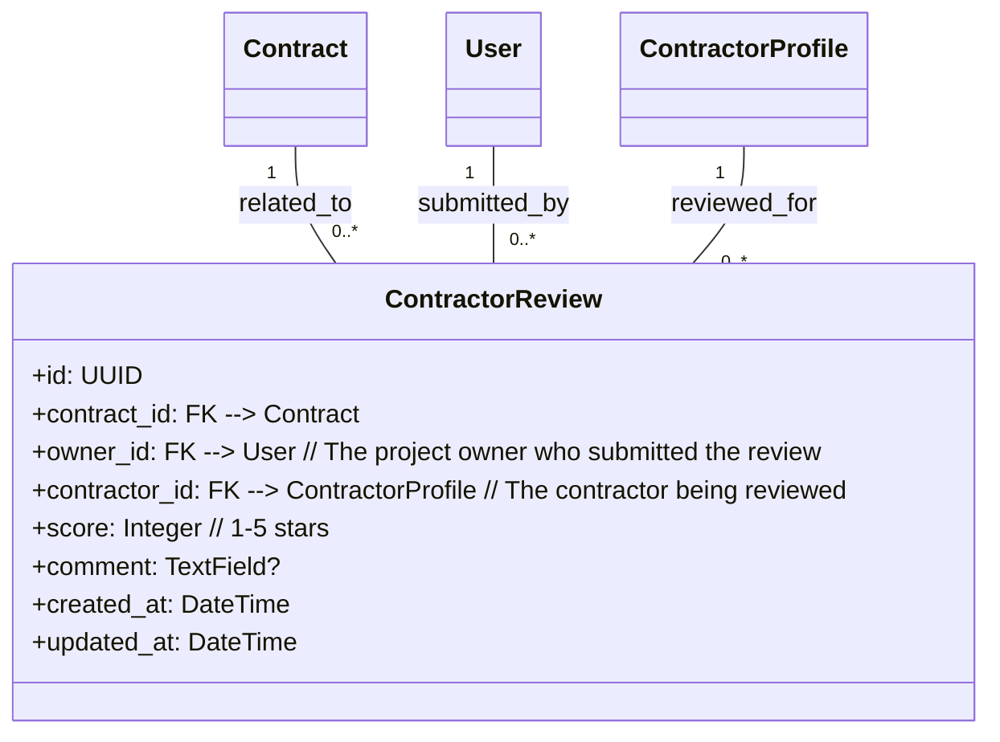

## Phase 2: Contractor + Contracts Execution Layer

**Overview:** This phase expands the platform to include a marketplace for construction services and contracts. It introduces new user roles for contractors, mechanisms for posting tenders, bidding, and managing project execution through milestones. The schemas reflect the core entities required to facilitate service-based procurement.

### Core Entities:

#### 2.1. Contractor Profile (`contractors_contractor`)
Represents a professional contractor or construction firm offering services on the platform. It extends the base `User` model with specific contractor details and performance metrics. This is distinct from `VendorProfile` for material suppliers.

#### 2.2. Contractor Certification (`contractors_certification`)
Documents specific qualifications, licenses, or industry certifications held by a `ContractorProfile`, crucial for verification and establishing trust.

#### 2.3. Contract (`contracts_contract`)
Represents a formal agreement or tender for construction services posted by a project owner. It outlines the scope of work, budget, timeline, and current execution status.

#### 2.4. Bid (`contracts_bid`)
Captures a contractor's formal offer in response to a `Contract` (tender). It includes the proposed cost, timeline, and a message from the contractor.

#### 2.5. Milestone (`contracts_milestone`)
Divides a `Contract` into smaller, manageable stages with defined deliverables, amounts, and due dates. Used for tracking progress and triggering payments.

#### 2.6. Milestone Payment (`payments_milestone_payment`)
Links a specific `Milestone` completion to a payment record. In this phase, it signifies the initiation of a payment process upon milestone approval.

#### 2.7. Contractor Review (`reviews_contractor_rating`)
Allows project owners to provide feedback and ratings on a `ContractorProfile` after a `Contract` is completed, contributing to the contractor's reputation.

---