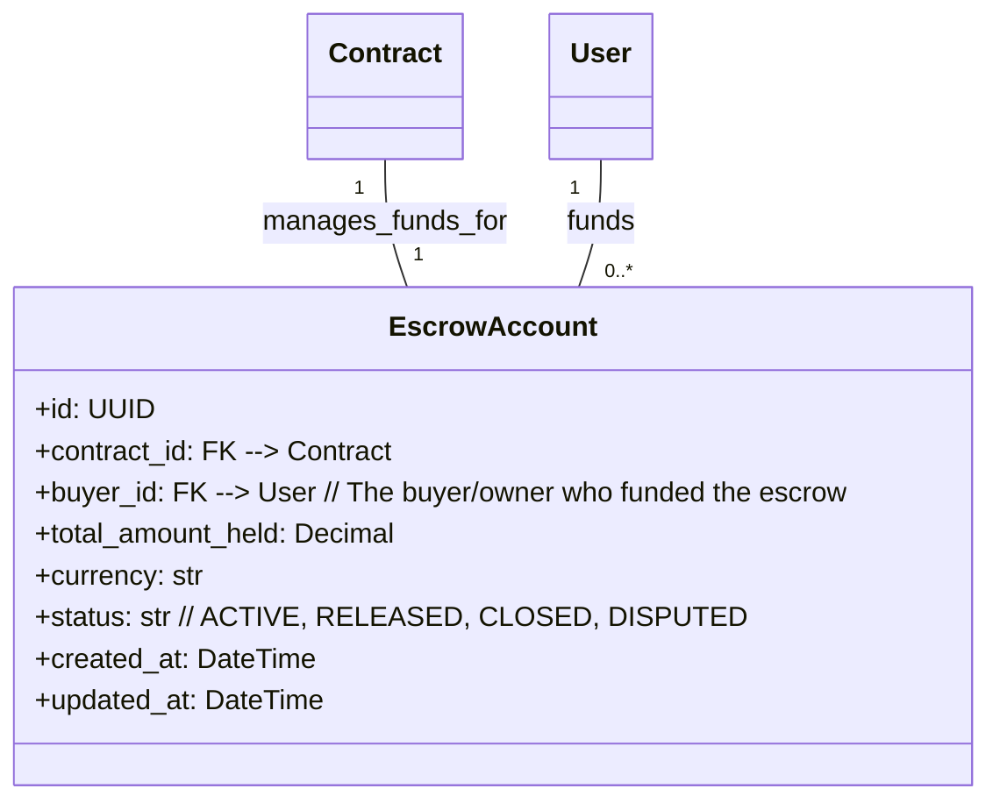
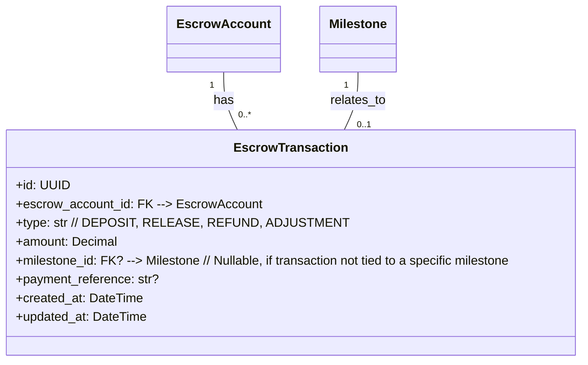
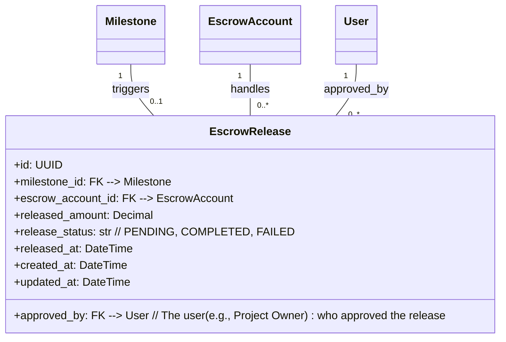
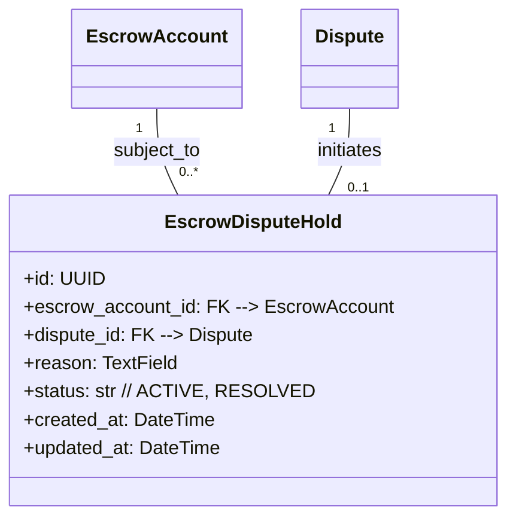

## Phase 3: Escrow + Embedded Finance Layer

**Overview:** This pivotal phase introduces the robust financial infrastructure, transitioning from placeholder payments to a secure, automated escrow system. It focuses on mitigating payment and delivery risks, laying the groundwork for embedded financing, and formalizing dispute resolution.

### Core Entities:

#### 3.1. Escrow Account (`escrow_account`)
Represents a dedicated account where funds are securely held for a specific `Contract` or order, ensuring trust between transacting parties.

#### 3.2. Escrow Transaction (`escrow_transaction`)
Records every movement of funds into, within, or out of an `EscrowAccount`, providing a complete audit trail for financial flows.

#### 3.3. Escrow Release (`escrow_release`)
Documents the approval and release of funds from an `EscrowAccount` upon the successful completion and approval of a `Milestone`.

#### 3.4. Escrow Dispute Hold (`escrow_hold`)
Captures the state when funds in an `EscrowAccount` are temporarily frozen due to a `Dispute`, awaiting arbitration.

---