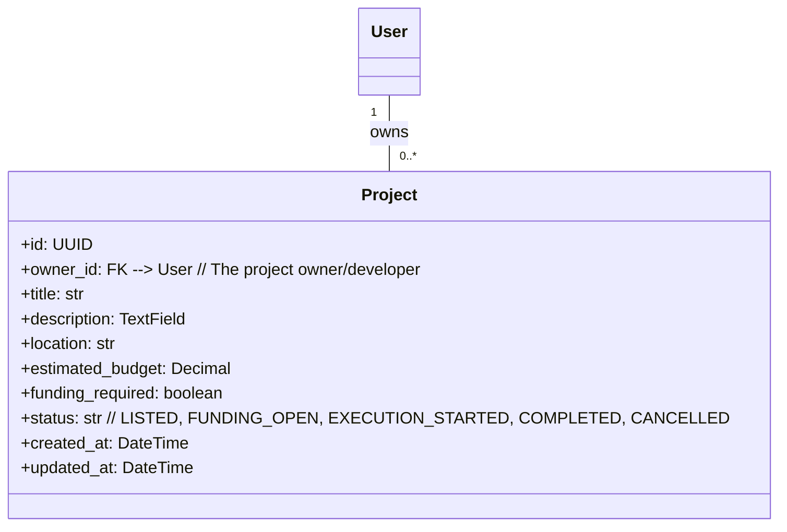
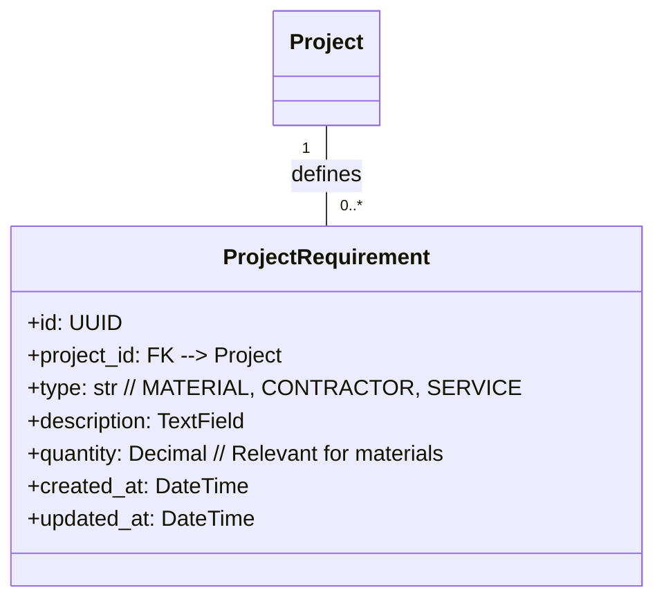
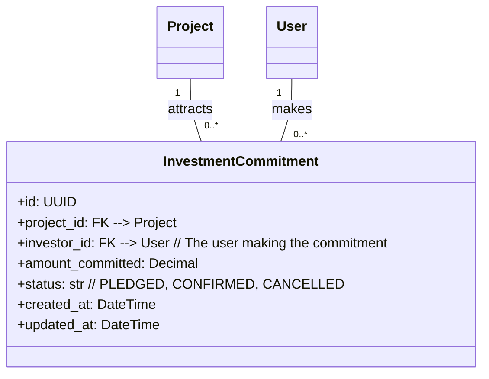
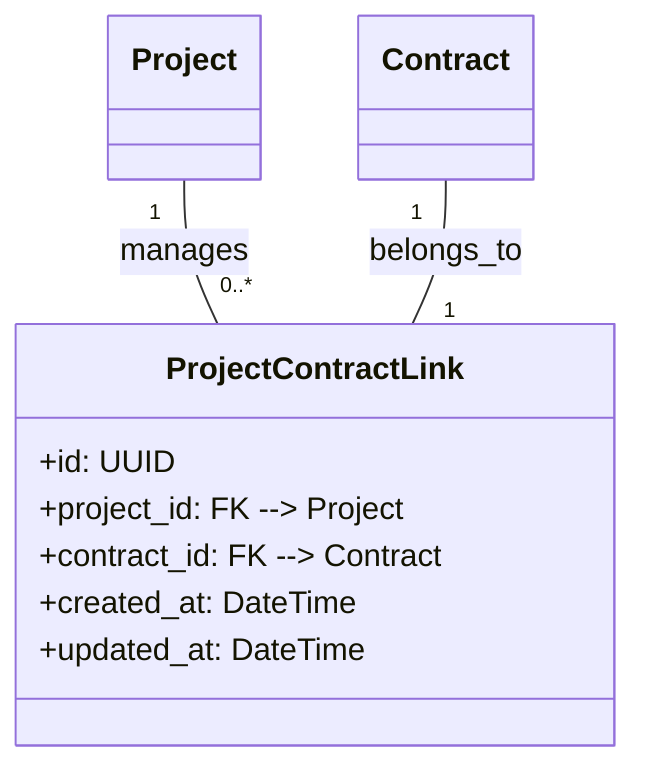
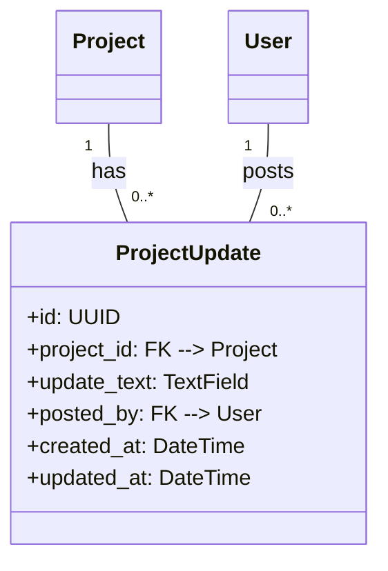
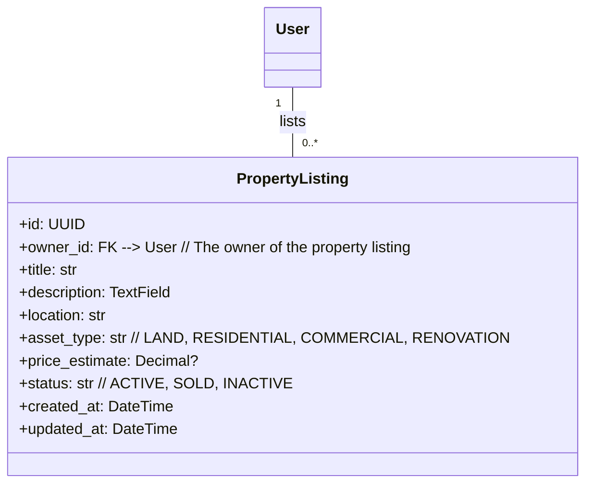
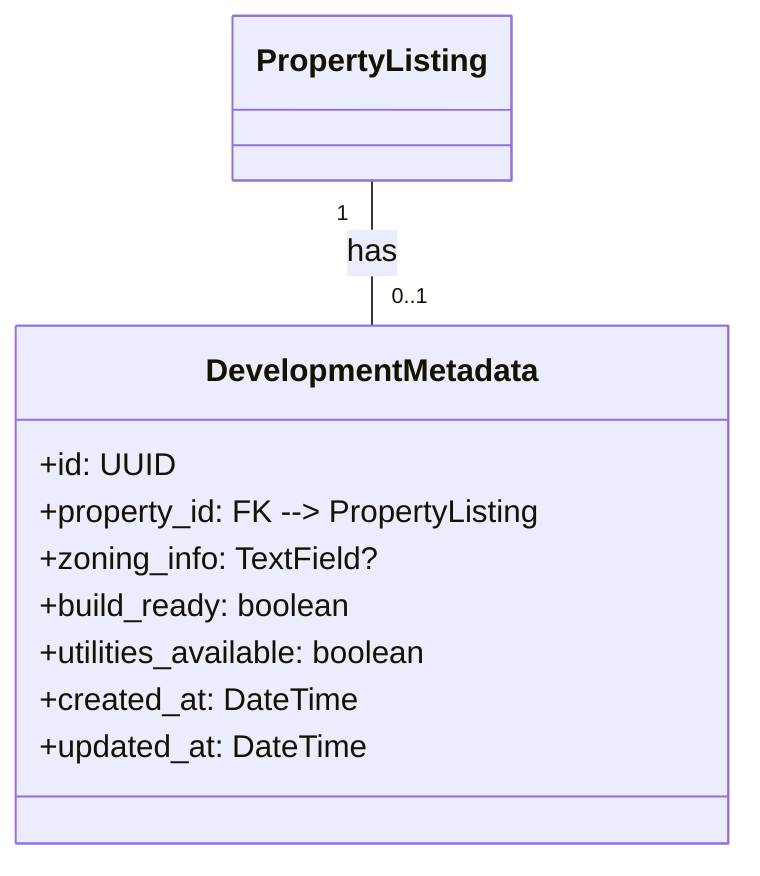
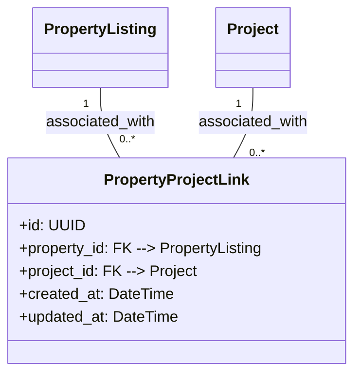

## Phase 4: Projects + Property + Capital Pipeline

**Overview:** This phase elevates the platform beyond individual transactions to managing entire construction project lifecycles. It introduces mechanisms for project listing, property asset management, and foundational support for investment commitments, linking all previous phases into a comprehensive project management ecosystem.

### Core Entities:

#### 4.1. Project (`projects_project`)
The central entity for managing a construction initiative, encapsulating its overall scope, budget, timeline, and status. It acts as an umbrella for multiple `Contract`s and `Product` procurements.

#### 4.2. Project Requirement (`projects_requirement`)
Details the specific materials, contractors, or services needed to execute a `Project`, linking directly to the marketplace functionalities established in earlier phases.

#### 4.3. Investment Commitment (`projects_investment_commitment`)
Represents an investor's non-binding pledge of funds towards a `Project`, serving as a preliminary indicator of funding interest before formal agreements.

#### 4.4. Project Contract Link (`projects_project_contract`)
Establishes the relationship between an overarching `Project` and the individual `Contract`s executed as part of that project.

#### 4.5. Project Update (`projects_update`)
Allows project owners to post progress updates, significant events, or challenges related to a `Project`, providing transparency to stakeholders.

#### 4.6. Property Listing (`property_listing`)
Enables owners to list land or existing structures that are potential sites for new construction or renovation `Project`s. This serves as an upstream demand generator.

#### 4.7. Development Metadata (`property_development`)
Provides additional details about the development potential of a `PropertyListing`, such as zoning information or utility availability.

#### 4.8. Property Project Link (`property_project_link`)
Connects a `PropertyListing` to a `Project`, indicating that the project is being developed on or is related to that specific property.

---