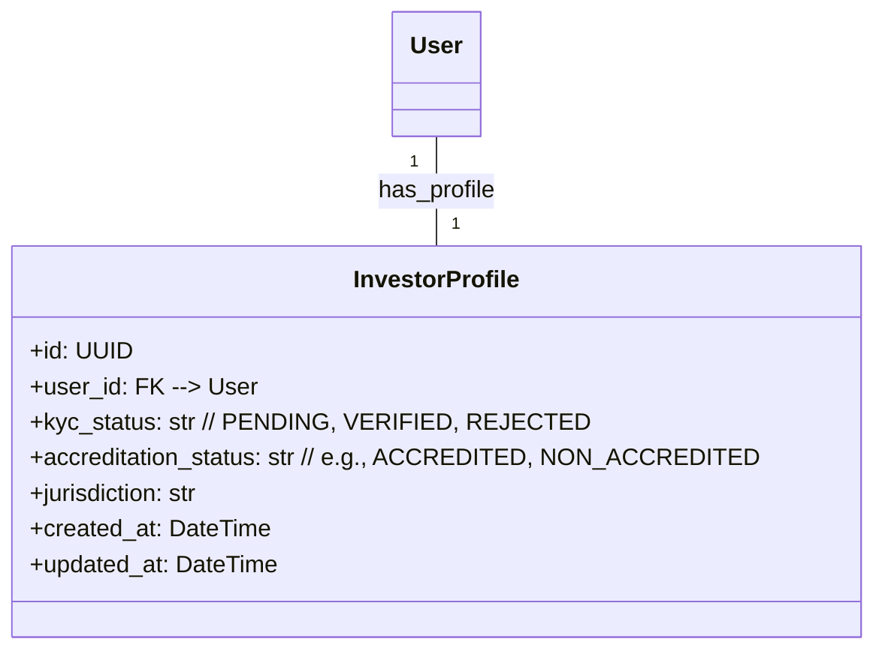
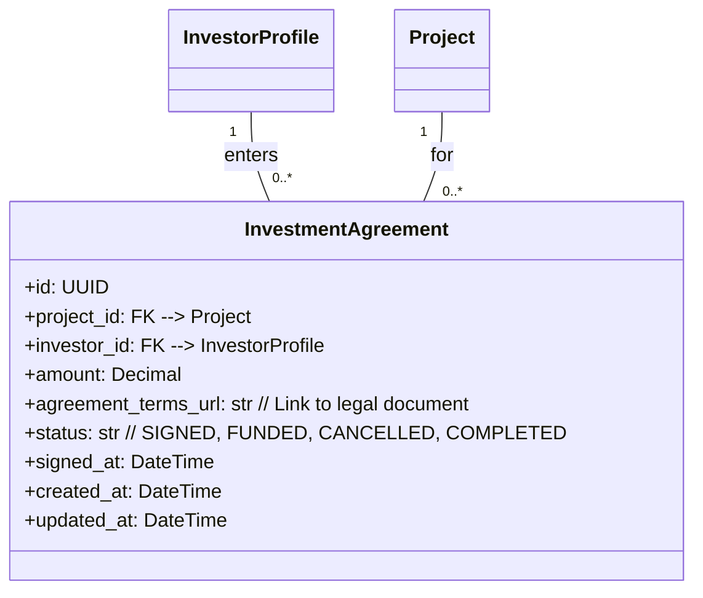
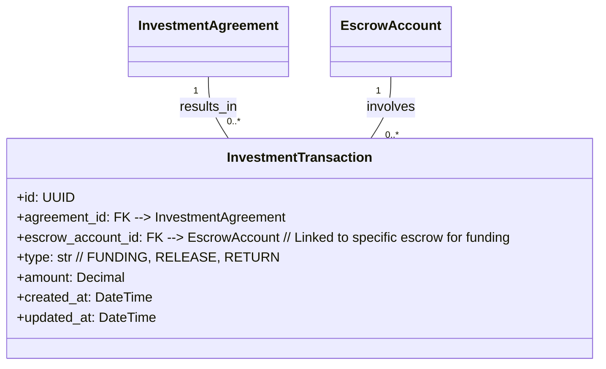
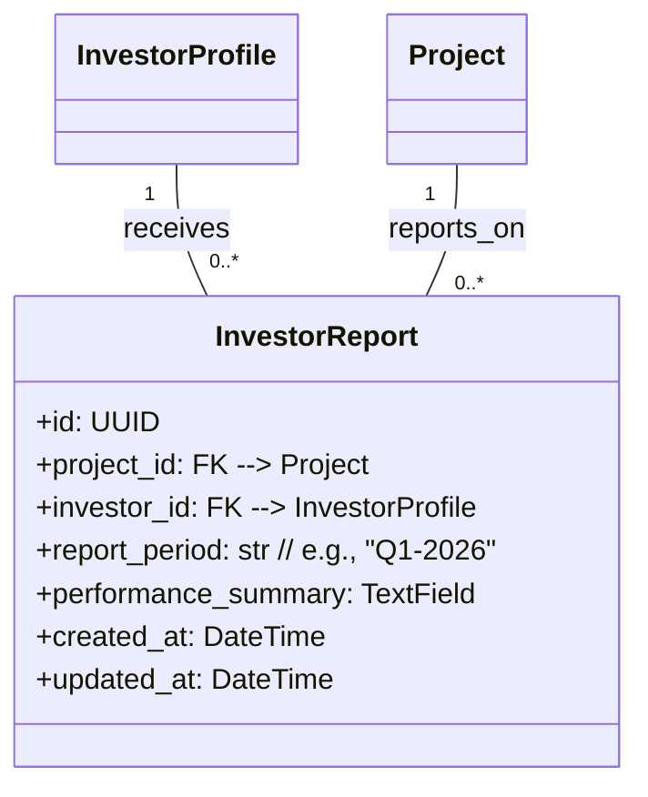

## Phase 5: Regulated Investment + Enterprise + Government Layer

**Overview:** This critical phase solidifies the platform's role as institutional infrastructure by introducing regulated investment flows, specialized features for enterprise procurement, and compliance-driven modules for government tendering. It emphasizes robust identity verification and financial governance.

### Core Entities:

#### 5.1. Investor Profile (`investor_profile`)
Extends the base `User` model for individuals or entities participating in regulated investment activities. It includes fields for KYC/AML status and accreditation, essential for compliance.

#### 5.2. Investment Agreement (`investment_agreement`)
Represents a legally binding contract between an `InvestorProfile` and a `Project`, formalizing the funding commitment initiated in Phase 4.

#### 5.3. Investment Transaction (`investment_transaction`)
Records the actual movement of capital corresponding to an `InvestmentAgreement`, often linked directly to `EscrowAccount`s for secure deployment.

#### 5.4. Investor Report (`investor_report`)
Provides periodic performance summaries and updates to `InvestorProfile`s regarding their investments in specific `Project`s.

---