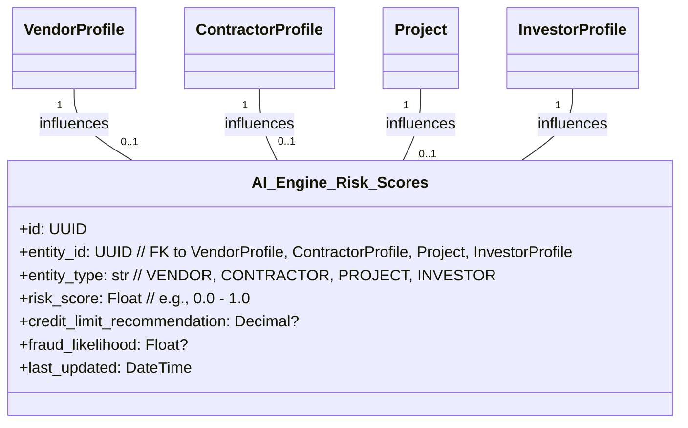
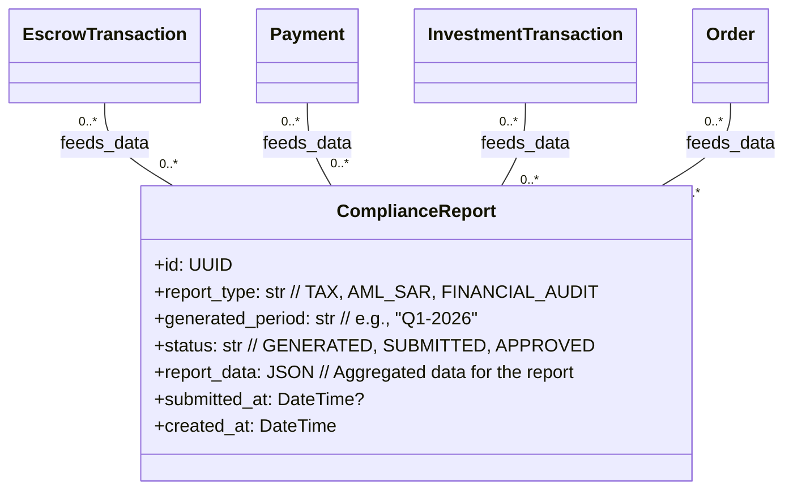
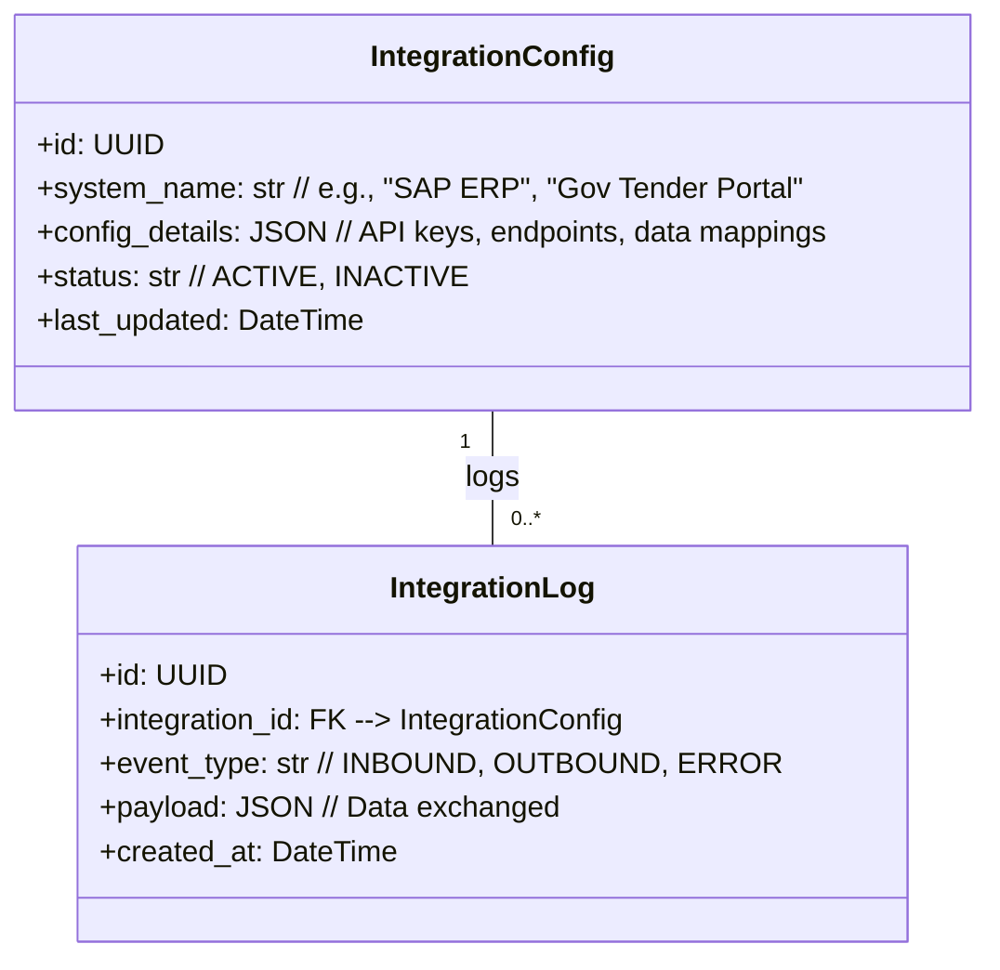
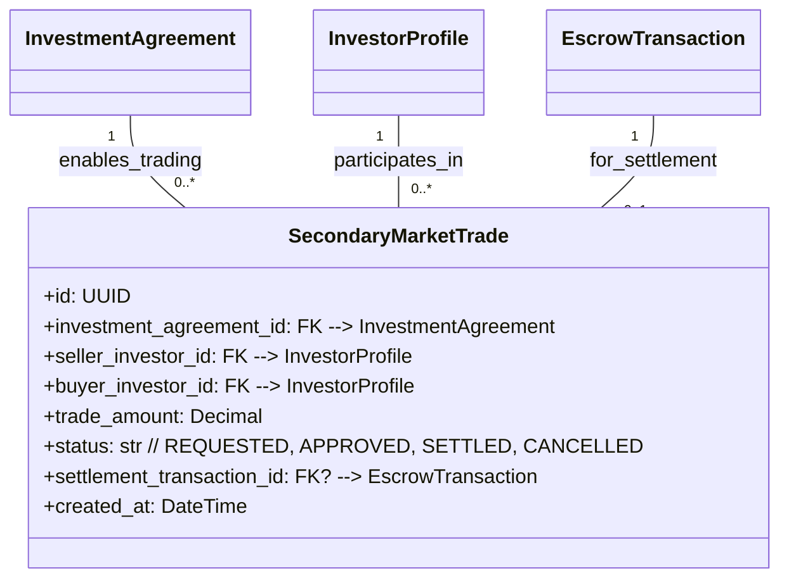

## Phase 6: Institutional Construction Infrastructure OS

**Overview:** This ultimate phase solidifies the platform as a global operating system for construction. It focuses on full regulatory integration, advanced AI-driven intelligence, and seamless integration with external enterprise and government systems. While this phase introduces fewer *new* core schema entities, it significantly enhances the functionality and impact of existing ones through advanced logic and data utilization.

### Key Schema Interactions and Enhancements:

#### 6.1. AI-Driven Risk & Underwriting (`AI_Engine_Risk_Scores`)
The advanced AI engine utilizes data from `VendorProfile`, `ContractorProfile`, `Project`, `EscrowAccount`, and `InvestmentAgreement` to generate dynamic risk scores and underwriting recommendations. These scores would typically be fields added to the respective profiles or related models, influencing operational decisions.

**Description:** The AI engine processes historical performance data (e.g., `Order` fulfillment rates, `Contract` completion, `EscrowTransaction` history, `InvestmentTransaction`s) to continuously update these risk scores. These scores are crucial for dynamic credit limits, fraud detection, and automated underwriting decisions for embedded finance products.

#### 6.2. Regulatory Reporting Automation (`Compliance_Reports`)
This functionality relies heavily on audit trails and financial transaction data captured in existing schemas like `EscrowTransaction`, `Payment`, `InvestmentTransaction`, and `Order`. It ensures that all necessary data for tax filings (VAT/GST), AML suspicious activity reports (SARs), and other compliance exports are correctly aggregated and formatted.

**Description:** The system automates the generation of various regulatory reports by querying and compiling data from numerous transactional schemas. This ensures that the platform remains compliant across different jurisdictions.

#### 6.3. Deep Integrations (ERP, Government, Logistics)
These integrations typically involve middleware or API layers that map platform data to external systems. While not requiring new core schema entities, they would involve configuration models and possibly audit logs for integration activities.

*   **Integration Configuration (`integrations_config`):** Defines parameters for connecting to external ERPs or government portals (e.g., API keys, endpoint URLs, data mapping rules).
*   **Integration Log (`integrations_log`):** Records all inbound and outbound data exchanges with external systems for auditing and debugging.

**Description:** These models facilitate the seamless exchange of data with enterprise-level ERP systems and government procurement platforms, enabling automated workflows like purchase order syncing, invoice processing, and tender submissions directly from the platform.

#### 6.4. Secondary Liquidity Market (`secondary_market_trade`)
This optional framework allows for the regulated transfer of investment stakes. This would involve a new transaction type or status updates on existing `InvestmentAgreement`s.

**Description:** This schema enables the buying and selling of existing investment stakes in projects, creating a secondary market to provide liquidity to investors, subject to stringent regulatory oversight and compliance.

---